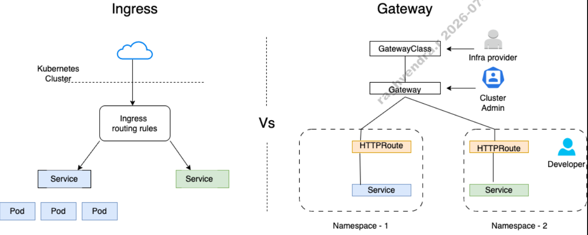

## Kubernetes Gateway API: Knowledge Base & Ingress Comparison

While Ingress focuses on a single, monolithic resource to manage routing, Gateway API breaks down traffic routing into role-oriented, modular resources. It offers better flexibility, native support for advanced traffic splitting, header-based routing, cross-namespace routing, and multi-protocol support (TCP, UDP, gRPC, HTTP).

##### 1. Role Separation & Architecture
**Traditional Ingress Architecture (Monolithic)**
- In the traditional model, a single Ingress object attempts to handle everything from host definitions to path routing, TLS certs, and controller-specific options.
```text
                  +--------------------------+
                  |      External Traffic    |
                  +-------------+------------+
                                |
                                v
               +--------------------------------+
               |    Ingress Controller (Pod)    |
               +----------------+---------------+
                                |
                                v
     +-----------------------------------------------------+
     |                   Ingress Object                    |
     |  - Host: app.example.com                            |
     |  - TLS: app-tls-cert                                |
     |  - Path: /api -> api-service                        |
     |  - Annotations: rewrite-target, canary rules, etc.  |
     +--------------------------+--------------------------+
                                |
                                v
                     +--------------------+
                     |   api-service      |
                     +--------------------+
```

**Gateway API Architecture (Role-Oriented & Modular)**
Gateway API separates concerns by assigning different Kubernetes resources to specific personas:
```text
+-------------------------------------------------------------------+
| INFRASTRUCTURE PROVIDER                                           |
| Configures Controller software across the cluster                 |
|                                                                   |
|                      +------------------+                         |
|                      |   GatewayClass   |                         |
|                      +--------+---------+                         |
+-------------------------------|-----------------------------------+
                                | manages
+-------------------------------+-----------------------------------+
| CLUSTER / NETWORK ADMIN       v                                   |
| Defines entry points, ports, protocols, and TLS certificates      |
|                                                                   |
|                         +-----------+                             |
|                         |  Gateway  |                             |
|                         +-----+-----+                             |
+-------------------------------|-----------------------------------+
                                | attaches to
+-------------------------------+-----------------------------------+
| APPLICATION DEVELOPERS        v                                   |
| Manage routing rules and backends independently                   |
|                                                                   |
|                      +------------------+                         |
|                      |    HTTPRoute     |                         |
|                      +--------+---------+                         |
+-------------------------------|-----------------------------------+
                                | routes to
                                v
                      +------------------+
                      |   Backend Pods   |
                      +------------------+
```

##### 2. Structural Comparison
- ***The Ingress Way (Monolithic)***
```yaml
apiVersion: networking.k8s.io/v1
kind: Ingress
metadata:
  name: my-app-ingress
  annotations:
    nginx.ingress.kubernetes.io/rewrite-target: /
spec:
  ingressClassName: nginx
  tls:
  - hosts:
    - app.example.com
    secretName: app-tls-cert
  rules:
  - host: app.example.com
    http:
      paths:
      - path: /api
        pathType: Prefix
        backend:
          service:
            name: api-service
            port:
              number: 8080
```
***The Gateway API Way (Modular)***
- Step A: Define the Gateway (Cluster Admin)
```yaml
apiVersion: gateway.networking.k8s.io/v1
kind: Gateway
metadata:
  name: prod-gateway
  namespace: gateway-infra
spec:
  gatewayClassName: eg # e.g., Envoy Gateway, Cilium, Istio
  listeners:
  - name: https
    protocol: HTTPS
    port: 443
    hostname: "*.example.com"
    tls:
      mode: Terminate
      certificateRefs:
      - name: example-com-cert
    allowedRoutes:
      namespaces:
        from: All
```
- Step B: Define the HTTPRoute (App Developer)
```yaml
apiVersion: gateway.networking.k8s.io/v1
kind: HTTPRoute
metadata:
  name: api-route
  namespace: default
spec:
  parentRefs:
  - name: prod-gateway
    namespace: gateway-infra
  hostnames:
  - "app.example.com"
  rules:
  - matches:
    - path:
        type: PathPrefix
        value: /api
    backendRefs:
    - name: api-service
      port: 8080
```

##### 3. Advanced Use Cases
- ###### Step A: Define the Gateway (Cluster Admin)
```yaml
apiVersion: gateway.networking.k8s.io/v1
kind: Gateway
metadata:
  name: prod-gateway
  namespace: gateway-infra
spec:
  gatewayClassName: eg # e.g., Envoy Gateway, Cilium, Istio
  listeners:
  - name: https
    protocol: HTTPS
    port: 443
    hostname: "*.example.com"
    tls:
      mode: Terminate
      certificateRefs:
      - name: example-com-cert
    allowedRoutes:
      namespaces:
        from: All
```
######  Step B: Define the HTTPRoute (App Developer)
```yaml
apiVersion: gateway.networking.k8s.io/v1
kind: HTTPRoute
metadata:
  name: api-route
  namespace: default
spec:
  parentRefs:
  - name: prod-gateway
    namespace: gateway-infra
  hostnames:
  - "app.example.com"
  rules:
  - matches:
    - path:
        type: PathPrefix
        value: /api
    backendRefs:
    - name: api-service
      port: 8080
```

### 3. Advanced Use Cases
##### Traffic Splitting (Canary / Blue-Green)
Native weight-based traffic splitting eliminates the need for vendor-specific annotations.
```
                           +---------------+
                           |   HTTPRoute   |
                           +-------+-------+
                                   |
                  +----------------+----------------+
      90% Traffic |                                 | 10% Traffic
                  v                                 v
        +-------------------+             +-------------------+
        |  app-v1-service   |             |  app-v2-service   |
        +-------------------+             +-------------------+
```
```yaml
apiVersion: gateway.networking.k8s.io/v1
kind: HTTPRoute
metadata:
  name: canary-route
spec:
  parentRefs:
  - name: prod-gateway
    namespace: gateway-infra
  hostnames:
  - "app.example.com"
  rules:
  - matches:
    - path:
        type: PathPrefix
        value: /
    backendRefs:
    - name: app-v1-service
      port: 80
      weight: 90
    - name: app-v2-service
      port: 80
      weight: 10
```
### Header-Based Routing & Path Rewriting
```
                          Incoming Request
                                  |
               +------------------+------------------+
               |                                     |
    Header: X-Beta-Tester: true           Path: /v1/old-api
               |                                     |
               v                                     v
     [ Route to Staging ]                 [ Rewrite to /v2/new-api ]
               |                                     |
               v                                     v
     +-------------------+                 +-------------------+
     |  staging-service  |                 |  new-api-service  |
     +-------------------+                 +-------------------+
```
```yaml
apiVersion: gateway.networking.k8s.io/v1
kind: HTTPRoute
metadata:
  name: header-routing-example
spec:
  parentRefs:
  - name: prod-gateway
    namespace: gateway-infra
  hostnames:
  - "app.example.com"
  rules:
  # Rule 1: Custom Header Match
  - matches:
    - headers:
      - name: X-Beta-Tester
        value: "true"
    backendRefs:
    - name: staging-service
      port: 80

  # Rule 2: Path Rewrite Match
  - matches:
    - path:
        type: PathPrefix
        value: /v1/old-api
    filters:
    - type: URLRewrite
      urlRewrite:
        path:
          type: ReplacePrefixMatch
          replacePrefixMatch: /v2/new-api
    backendRefs:
    - name: new-api-service
      port: 80
```

##### Key Takeaways
- Role Security: Application developers no longer need access to cluster-wide TLS secrets or ingress infrastructure to configure routes.

- Portability: Features like canary splitting, header matching, and path rewrites are standardized across implementations (Envoy, Istio, Cilium, NGINX), eliminating controller annotations.

- Extensibility: Supports non-HTTP traffic natively through TLSRoute, TCPRoute, and UDPRoute.
