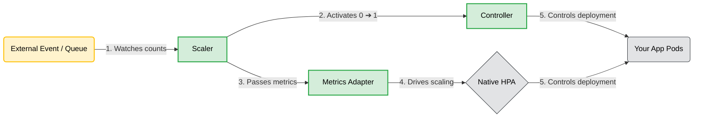

### The 3 Simple Components of KEDA
To keep it straightforward, KEDA handles scaling by breaking the work down into three specific internal components:
1. Scaler:
  > The outward-facing connector. It acts as an integration bridge to read external metrics directly from event sources like Kafka, RabbitMQ, Azure Service Bus, or databases.

2. Metrics Adapter:
  > The inward-facing translator. It takes those external event metrics (like queue length) and translates them into a standard format that the native Kubernetes Horizontal Pod Autoscaler (HPA) can read.

3. Controller:
  > The execution brain. It is responsible for handling the "Scale-To-Zero" lifecycle. It completely wakes an application up from 0 to 1 pod when a message arrives, or tears it down to 0 when the queue is completely empty.

#### KEDA does not actually scale your pods.
    KEDA acts as a smart data supplier. It does the heavy lifting of talking to the outside world, grabs the event numbers, and hands them off directly to the native Kubernetes HPA engine
    The HPA then runs its standard mathematical formula and executes the actual scale-up or scale-down operation.

#### The One Exception: Waking Up from Zero
    There is only one moment where KEDA bypasses the HPA and scales the app itself: When the application is sitting at 0 pods.
    Because the native HPA cannot calculate math for a pod that doesn't exist (multiplying by 0 replicas always equals 0), the HPA goes completely to sleep when an app scales to zero.
- The 0 ➔ 1 Jump: KEDA's internal Controller notices the very first message enter an empty queue. It steps in, bypasses the sleeping HPA, and manually updates your deployment from 0 replicas to 1 replica.
- The 1 ➔ N Flow: The moment that 1st pod wakes up, KEDA hands the tracking metrics back over to the HPA.
